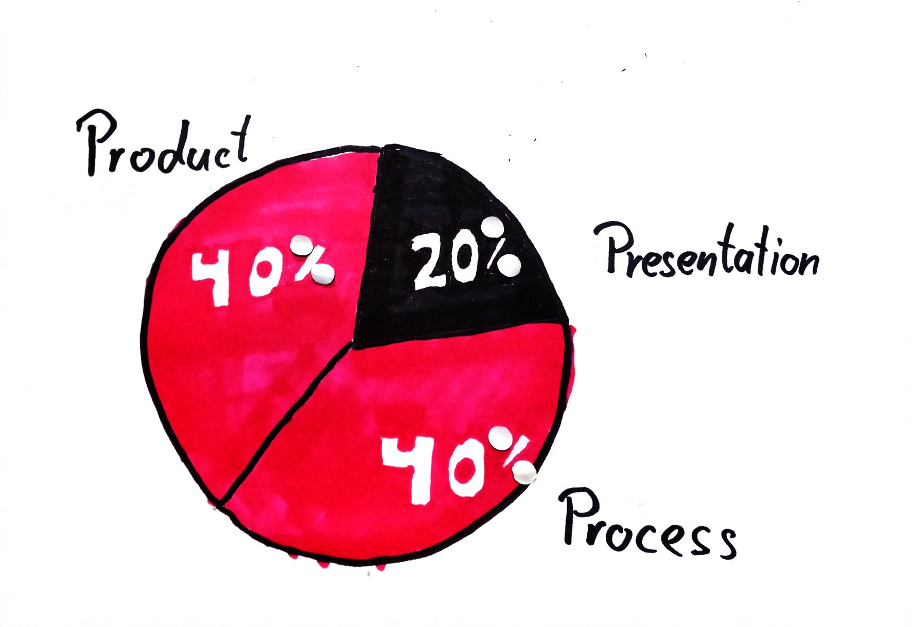
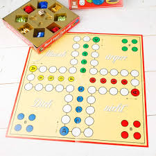
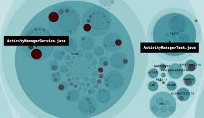

Christian H&ouml;rauf 
@fonzygruen 
Email: christian.hoerauf@gmail.com

??Note
Welcome to the Seminar of Web-Engineering. My name is Christian Hörauf, and I have been working the IT-Industry for 16 years now. 7 of them I spend in the Web-Business as Frontend Developer. Currently I work for Consorsbank in Nürnberg.

??HORIZONTAL
## Goals of the seminar
* Focus Frontend Technologies <!-- .element: class="fragment" -->
* Simulation of the job "Programmer"  <!-- .element: class="fragment" -->
* Learn methods and tools of SoftwareDevelopment <!-- .element: class="fragment" -->
* Software Craftspeople: What is good and bad Software? <!-- .element: class="fragment" -->

??NOTE
First of all, we will concentrate in this course on Frontend technologies that help to create a good user experience. There are several programming languages that help you on this issue, but we will see, that JavaScript plays a very important role here.
The second goal I try to hit is to give you an idea about how it feels like to be a programmer. I want you to see not only how demanding such a job is, but also how interesting and funny it can be. And even if you will not write code yourself in your job and become more of a Project Manager or Product Owner, it is good that you get a gut feeling of what a Software Developer can do and what she / he can't do. 
For that you ought to learn some of the methods and tools that are important to get a Software Project going. So we will have a short view on Scrum and several quality measures and tools you will find in the industry.
Finally I have to confess, that I am a member of the Software Craftspeople community and I hope to give an impression about what is good and bad software.

<!-- ??HORIZONTAL
## Don't ask what your country can code for your, ask what you can code for your country.

Note:
Jeder von Ihnen hat vermutlich heute ein Smartphone in der Tasche.  -->

??HORIZONTAL
## How you will be graded

??NOTE
I know, I know, you are very interested in the topic itself. But somehow you need a grade for this course. So the good message is, there won't be Test for this course. But I have several bad news for you. You will do a presentation about a web framework, which will take 20% of the end result. In addition we will create a Software project together. This will be some kind of simple Frontend only game or if you come up with an interesting idea, I would like to support you in realizing it. But the Project itself and how you present it will only be rated with 40% of the complete grade. The missing 40% I will spend on the way you will implement the project. So what quality measures do you take, how fast can you deploy a new version and similar aspects, that we will discuss on the second seminar day.

??HORIZONTAL
## Other organizational stuff
* Thu 10.10.2019 10:00-17:30
* Thu 07.11.2019 10:00-17:30
* Sat 09.11.2019 10:00-17:30
* Thu 12.12.2019 10:00-17:30
* Sat 14.12.2019 10:00-17:30
* xxx xx.01.2020 10:00-17:30 <!-- .element: class="fragment" -->

??NOTE
Besides the 5 Course-Days we will have this year, we will have another one in January. Since we do not yet exactly know, when your Tests will we be, we will have to figure out the last dates, when you know your Test appointments. (around november)
In addition, you will work on the software projects in groups of 4-5 students. I will act as Product Owner (I will explain later what that is) of your projects, so that I can take into account that your time is limited. To do so, each group will have a video chat with me for about 30 minutes every two weeks. 

??HORIZONTAL
## Iterative Sprint Reviews
* Every two weeks
* beginning Tue 22.10.2019 / Wed 23.10.2019 
* until Tue 17.12.2019 / Wed 18.12.2019
* 21:00-21:30 or 21:30-22:00
* That means 5 times 30 minute video chat

??NOTE
* Please let me know if a group needs a shift in those dates

??HORIZONTAL
## Teambuilding I
Line up in a row sorted by age.

??NOTE
To find the proper groups, we will do now some small exercises. Please first line up by age. If you do not know each other, please use this exercise to get to know each other a little bit.

??HORIZONTAL
## Teambuilding II
Asuming, the room mirrors the area of germany, please position yourself where you come from in reality.

??HORIZONTAL
## Teambuilding III
Lineup in a row sorted by your experience in computer science. How many lines of code have you written roughly?

??NOTE
We know there will be about 21 participants. Split the line after 8
people, so that 2 good programmers come up 3 medicore programmers.

abcdefgh ijklmnopqrstu -> ghijkl femno dcpqr abstu 

??HORIZONTAL
## Break for 10 Minutes
Select a group name

??HORIZONTAL
## Presentations
* All presentations have to be prepared until 9.11.2019 <!-- .element: class="fragment" -->
* Shall take about 20 min presentation and 10 min questions <!-- .element: class="fragment" -->
* As preperation work through the "Getting Started" Tutorials <!-- .element: class="fragment" -->
* Present the core features of the specific famework <!-- .element: class="fragment" -->
* Give a simple example from Getting Started <!-- .element: class="fragment" -->
* Give your groups gut feeling. Did you like the Framework? Do you want to use it for your project? <!-- .element: class="fragment" -->

??HORIZONTAL
## Presentations

??NOTE
You do not need to use the framework, you present here, as framework in your software project. Just get an impression and inspiration what fits your needs. So which group takes which framework to present?

??HORIZONTAL
## Presentations

??NOTE
You do not need to use the framework, you present here, as framework in your software project. Just get an impression and inspiration what fits your needs. So which group takes which framework to present?

??HORIZONTAL
## Presentations

??NOTE
You do not need to use the framework, you present here, as framework in your software project. Just get an impression and inspiration what fits your needs. So which group takes which framework to present?

??HORIZONTAL
## Presentations

??NOTE
You do not need to use the framework, you present here, as framework in your software project. Just get an impression and inspiration what fits your needs. So which group takes which framework to present?

??HORIZONTAL
## About the Software Project
1. Feel free to bring in your own ideas <!-- .element: class="fragment" -->
1. Feel free to in include a backend solution <!-- .element: class="fragment" -->
1. Everybody codes! <!-- .element: class="fragment" -->
1. I can always get the latest working iteration of your software <!-- .element: class="fragment" -->
1. I get access to your version control system <!-- .element: class="fragment" -->
1. I get access to your ticket system <!-- .element: class="fragment" -->
1. I get access to your wiki <!-- .element: class="fragment" -->
1. I get your final tag <!-- .element: class="fragment" -->

??NOTE
Before I present you my ideas for Software Projects you can implement, let me say
1. All of these ideas are only ideas. If you have your own idea what your group wants to implement, then I will be happy to support you in it, as long it has a certain complexity. So I will not allow a pure commandline tool without gui.
2. All of these ideas have in common, that they do not need a backend server, to keep the complexity of system accesability away from you. But if you are able to include a backend server you can do so.
3. All of these ideas are not too complicated to realize. Maybe the most talented in your groups might hack one of those ideas in about 1-2 days. But I do not want you to quickly hack a result. I want you to get an idea how the process of implementing software in the industry looks like. Therefore I want all of your Teammates to code for the project and the skille programmers should also take care to set up a valid continious integration environmentor even continious deployment environment.
4. This means, me, your customer will always be able to see the latest usable iteration of your product.
5. I need access to your version controll system.
6. This means also, me, your lecturer, will have access to your ticket system.
7. And finally I get access to your wiki, where you will document your process and potential ugly parts that might arise.
8. When you think your done, you will tag the wiki and the repository with "Abschluß" and give me in adition the sha hashes of them. By that I will be able to have a final state of your work and will mark exactly that.

??HORIZONTAL
## Proposal I
### Mensch ärgere Dich nicht

??NOTE
Let's make a clone of the well known board game. There should also be a computer player to play against.

??HORIZONTAL
## Proposal II
### Crossword Puzzle

??NOTE
Let the user enter a word, look it up on wikipedia and randomly select words from that article and combine them to a crossword puzzle. The user will get a list of the used words and can by drag and drop complete the puzzle.

??HORIZONTAL
## PROPOSAL III
### DataDetector (with Electron)

??NOTE
A tool that scans a specific directory on your harddrive and displays which subdirectory needs how much disk space.
To be able to access the hardware we use Electron.

??HORIZONTAL
## PROPOSAL IV
### Stock Checker (Browser Plugin)

??NOTE
A Browser Plugin, that is able to check when one of the users selected stock values exceeds or falls below a certain price. By the way, although I will show you how to use our api, I will gain nothing from it, since it is very unrealistic that my company will provide such a tool to the users.
